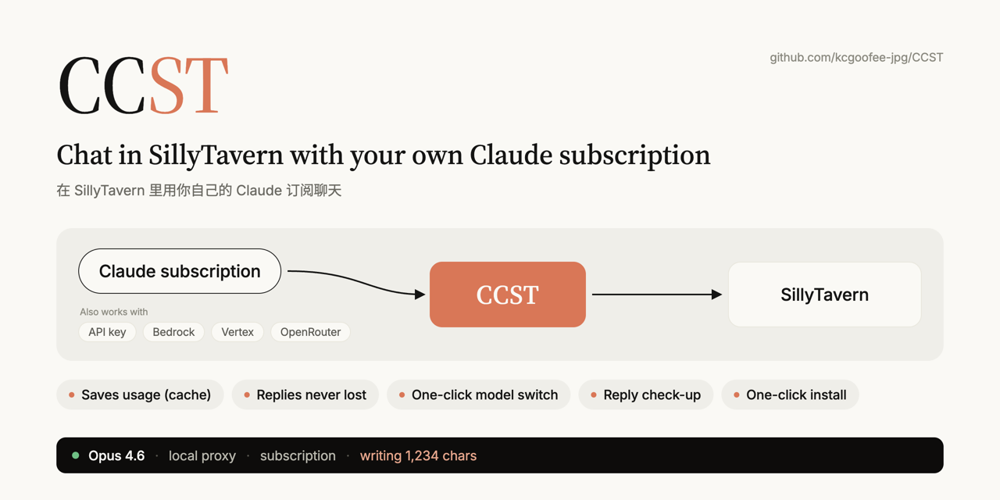
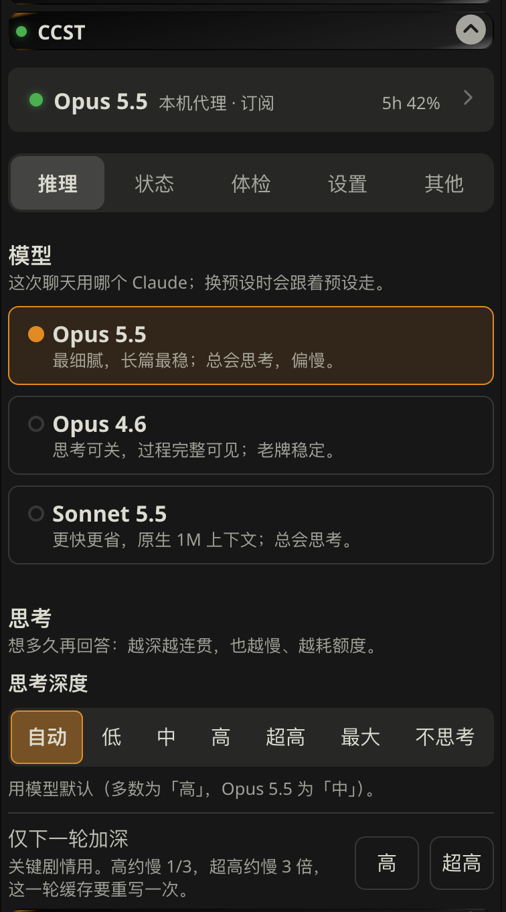
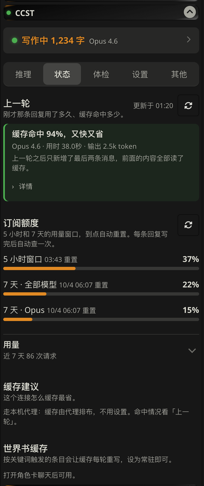

<div align="center">



[简体中文](README.md) · **English**

[](https://github.com/kcgoofee-jpg/CCST/releases)
[](https://github.com/kcgoofee-jpg/CCST/releases/latest)
[](https://github.com/kcgoofee-jpg/CCST/actions/workflows/test.yml)


[](LICENSE)

[Install](#install-5-minutes) · [Guide](docs/使用指南.md) · [Roadmap](docs/路线图.md) · [Changelog](CHANGELOG.md) · [Contributing](CONTRIBUTING.md) · [Security](SECURITY.md)

<sub>Not an official Anthropic product and not affiliated with Anthropic. Claude is a trademark of Anthropic.</sub>




</div>

> The panel's interface is in Chinese for now.

## What it is

SillyTavern on its own only talks to pay-per-token APIs. CCST is a SillyTavern plugin; once installed:

| | |
| --- | --- |
| 🎟️ **Use your subscription**<br>Claude Pro / Max, no separate API credit; API keys, Bedrock, Vertex and OpenRouter work too | 💰 **Long chats should cost less (estimate)**<br>In long chats the prompt cache can usually save re-processing part of the history; how much depends on your preset, world info and extensions |
| 🛟 **Replies survive disconnects**<br>Close the browser or drop the connection; the reply still finishes and is filled in later | 🔀 **Switch models in one click**<br>Opus 5.5 / Opus 4.6 / Sonnet 5.5, thinking depth on demand |
| 🩺 **Refusal / truncation alerts**<br>When the model refuses or the reply is cut off or empty, the status says so; length, banned-word and similar checks are in 「其他」 (Other), experimental | 📦 **Short install**<br>SillyTavern: paste one line in Terminal (Mac) or double-click the installer (Windows); Mac for TauriTavern and phone: paste a different line in Terminal, it ends in the menu |

The panel also shows your quota and per-turn usage.

> Note: effects such as cache savings depend on your preset, world info and other extensions. They are estimates, not measured on every combination; the per-turn cache hit shown in the panel is a measured value.

> [!CAUTION]
> Using a subscription through third-party software is **not** permitted by Anthropic; your account may be limited or banned. If that's not acceptable, use an API key (see "Other setups"). Read the [risks](#risks).

## You need

- A computer (Mac / Windows / Linux) with [SillyTavern](https://github.com/SillyTavern/SillyTavern) installed. [Node.js](https://nodejs.org) 18+ (the installer tells you if it's missing). TauriTavern / phone only, no SillyTavern on the computer: see usage 2 under "Other setups" (Mac only for now).
- A Claude Pro or Max subscription (or an API key).
- Chrome or Edge.

## Install (5 minutes)

No terminal, no editing files.

**1. Install the panel in SillyTavern.** Extensions (puzzle icon) → Install extension, paste this link and install:

```
https://github.com/kcgoofee-jpg/CCST
```

**2. Get the one-click installer.** Open the **CCST** panel. A card says it can't reach the CCST proxy; on Mac click "复制命令" (copy command), on Windows click **下载一键安装（Windows）**.

**3. Run it and sign in to Claude.** Mac: open Terminal, paste the line below and press Enter (Terminal downloads it itself, so macOS does not block it); Windows: double-click the downloaded file. It finds SillyTavern, installs what's needed and opens your browser once to sign in to Claude. It says 「装好了」 (done) at the end.


```
zsh -c "$(curl -fsSL https://raw.githubusercontent.com/kcgoofee-jpg/CCST/main/install-plugin-mac.sh)"
```

- Mac: don't double-click a downloaded `.command` file. On macOS 15 and later it is blocked ("cannot verify the developer", only "Done / Move to Trash"). The Terminal line above avoids that.
- Windows "Windows protected your PC": **More info → Run anyway**.
- No Node.js yet: it opens the download page; install it and run it again (paste the same line on Mac, double-click again on Windows).

**4. Restart SillyTavern.** Close and reopen it, then hard-refresh the browser (`Ctrl+F5`, Mac `Cmd+Shift+R`). The panel connects by itself.

From then on CCST starts with SillyTavern. To update, double-click the same file again.

<details>
<summary>Didn't work?</summary>

The installer only does these steps; you can do them by hand:

1. **Allow server plugins.** In SillyTavern's `config.yaml` set:

   ```yaml
   enableServerPlugins: true
   ```

2. **Download CCST.** In the SillyTavern folder (the one with `server.js`) run:

   ```bash
   node plugins.js install https://github.com/kcgoofee-jpg/CCST
   ```

3. **Install and sign in** (opens the browser once):

   ```bash
   cd plugins/CCST
   npm install
   npm run login
   ```

4. Restart SillyTavern and click **一键连接** (connect) in the CCST panel.

- **Panel can't reach the proxy**: check `config.yaml` says `true` and that you restarted. The SillyTavern console should show `[claude-subscription] initialised`.
- **Installer can't find SillyTavern**: drag the SillyTavern folder (with `server.js`) into the installer window and press Enter.
- **`npm install` fails**: don't use `--omit=optional`; Node must be 18+ (`node -v`).
- **Panel says you're not signed in**: run the installer again, or `npm run login` in `plugins/CCST`.
- **No download button / blocked by security software**: download from the [installer folder](installer) or follow the manual steps.

</details>

## Using it

The panel has four tabs; you mostly need the first. The first time, click **一键连接** (connect): it creates and selects a SillyTavern connection profile named "CCST" (it keeps the Claude model you already picked, else Opus 4.6) and asks you to check it under API Connections. Your existing profiles are not changed.

| Tab | What it does |
| --- | --- |
| **推理** (Reasoning) | Model and thinking depth (deeper = slower, more usage) |
| **状态** (Status) | Last turn in this chat: time and cache hit (refreshed when a reply ends); a line when the latest reply was refused, cut off or empty; subscription quota; 7-day usage |
| **设置** (Settings) | Proxy address, backend (subscription / API key / Bedrock …), thinking options, and an Advanced group (cache and context switches, thinking depth for background requests) |
| **其他** (Other) | Phone connection, Mac remote, debugging; plus an experimental, off-by-default "体检（实验）" group (length, banned words, repeats, card check; may give false alarms depending on preset and extensions) |

## Other setups

- **API key / Bedrock / Vertex / OpenRouter instead of a subscription**: install as above, then switch in Settings → 代理后端 (proxy backend). Keys stay on your computer.
- **No proxy, direct Claude API or OpenRouter**: just install the extension. Model switching and refusal / truncation notices work; reply recovery and quota don't.
- **SillyTavern on a server / Docker**: see the [guide](docs/使用指南.md#用法三-服务器与-docker) (Chinese).

**Three setups** (Chinese guide):
- Usage 1, vanilla SillyTavern on a computer: the install flow above ([details](docs/使用指南.md#用法一-原版酒馆)).
- Usage 2, TauriTavern / phone (**Mac only for now**): a Mac runs the standalone proxy; TauriTavern installs the panel and connects to it. Open Terminal and paste one line (installs to `~/CCST`; installs dependencies, signs in to Claude, puts a shortcut on the desktop, starts the proxy and opens TauriTavern without further questions, then drops straight into the 「酒馆工具」 menu; the window stays open until you press `q`):
  ```bash
  zsh -c "$(curl -fsSL https://raw.githubusercontent.com/kcgoofee-jpg/CCST/main/install-mac.sh)"
  ```
  On the phone: press `1` on the menu home page to open the 「手机」 (phone) page, press `x` to turn phone mode on, paste the 「手机连接码」 shown there into the panel card on the phone and tap 「连接」 (or scan the QR code and tap copy). To update: run the same line in Terminal again (it overwrites the code and keeps your login and data), then choose 「重启代理」 (restart proxy) in the menu. Windows / Linux: use usage 1 or 3. ([details](docs/使用指南.md#用法二-tauritavern-与手机))
- Usage 3, server / cloud: one command or Docker ([details](docs/使用指南.md#用法三-服务器与-docker); CI-tested on Linux; the image `ghcr.io/kcgoofee-jpg/ccst` is public on GHCR — `docker pull` just works).

More in the [guide](docs/使用指南.md) and [roadmap](docs/路线图.md) (Chinese).

## Limits

- No temperature, Top-P or Top-K.
- Phone / TauriTavern connecting to a proxy on your computer (phone connection code, QR code, the 「酒馆工具」 menu) is Mac only for now.
- Usage is shared with Claude.ai and subject to the 5-hour and 7-day windows.
- First token takes a few seconds longer than a direct API call.

## Risks

- **Not an approved use.** Anthropic's docs say third-party products may not use claude.ai sign-in or subscription usage without approval. Anthropic may restrict this at any time or act on accounts.
- **Content is bound by Anthropic's [Usage Policy](https://www.anthropic.com/legal/aup).** Explicit sexual content is prohibited; any sexual content involving minors is strictly prohibited and reported.
- **Don't expose the proxy to others or share accounts.**

The author is not responsible for limited or banned accounts or any other loss.

> Independently maintained fork of [LukaTheHero/SillyTavern-ClaudeSubscription](https://github.com/LukaTheHero/SillyTavern-ClaudeSubscription) (AGPL-3.0). Thanks to the original author.

## Related

- [tt-root-module](https://github.com/kcgoofee-jpg/tt-root-module): a KernelSU module for rooted Android phones that automatically backs up, verifies and syncs the data of TauriTavern (and SillyDroid / Termux SillyTavern) and restores it in one step. Worth installing if you run TauriTavern on a phone and don't want to lose your chats.

## License

[GNU AGPL v3.0 or later](LICENSE)
