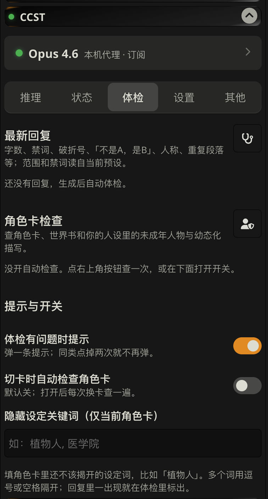

<div align="center">

# CCST

**在 SillyTavern（酒馆）里用你自己的 Claude 订阅聊天。**

**简体中文** · [English](README.en.md)

[](https://github.com/kcgoofee-jpg/CCST/releases)
[](https://github.com/kcgoofee-jpg/CCST/actions/workflows/test.yml)
[](LICENSE)

<sub>非 Anthropic 官方产品，与 Anthropic 无关。Claude 是 Anthropic 的商标。</sub>




</div>

## 这是什么

酒馆本身只能用按量付费的 API。CCST 是一个酒馆插件，装上以后：

- **用 Claude Pro / Max 订阅聊天**，不用另外买 API 额度（也支持 API 密钥、Bedrock、Vertex、OpenRouter）。
- **自动省额度**：长聊天每轮只重算新内容，其余走缓存。
- **回复不丢**：浏览器关了、断网了，回复照样写完，回来自动补上。
- **面板里一键切模型**（Opus 5.5 / Opus 4.6 / Sonnet 5.5）、调思考深度、看额度和每轮用量、检查回复质量。

> [!CAUTION]
> 用订阅跑第三方程序**不在** Anthropic 允许的范围内，账号可能被限制或封禁。不能接受就用 API 密钥（见下面「其他用法」）。详见[风险提示](#风险提示)。

## 你需要

- 一台电脑（Mac / Windows / Linux），装好 [SillyTavern](https://github.com/SillyTavern/SillyTavern)。[Node.js](https://nodejs.org) 18 以上（没有的话一键安装会提醒你）。
- Claude Pro 或 Max 订阅（或 API 密钥）。
- 浏览器用 Chrome 或 Edge。

## 安装（5 分钟）

不用打开终端、不用改任何文件。

**1. 在酒馆里装面板。** 酒馆顶部「扩展」（积木图标）→「安装扩展」，粘贴下面的链接，点安装：

```
https://github.com/kcgoofee-jpg/CCST
```

**2. 下载一键安装。** 装好后打开 **CCST** 面板，会看到一张「连不上 CCST 代理」的卡片，点里面的 **下载一键安装（Mac）** 或 **下载一键安装（Windows）**。

**3. 双击，跟着提示登录 Claude。** 双击下载的文件（Mac 下载的是压缩包，先双击解压，再双击里面的「CCST安装」）。它会自己找到酒馆、装好需要的东西，中间会打开浏览器让你登录 Claude 账号（只需一次）。全部完成时窗口里会写「装好了」。

- Mac 第一次打开可能提示「无法验证开发者」：在文件上**右键 →「打开」→ 再点「打开」**。
- Windows 可能弹出蓝色的「Windows 已保护你的电脑」：点「更多信息」→「仍要运行」。
- 电脑里没有 Node.js 的话，它会替你打开下载页；装好后再双击一次就行。

**4. 重启酒馆。** 关掉酒馆再打开，浏览器按 `Ctrl+F5`（Mac 是 `Cmd+Shift+R`）刷新。面板会自动连上，之后就能聊天了。

以后只要正常启动酒馆，CCST 会跟着启动，不用再做任何事。想更新：再双击一次同一个文件。

<details>
<summary>装不上？</summary>

一键安装其实只做了下面这几件事，卡住的话可以自己手动做：

1. **打开服务端插件开关。** 用记事本打开酒馆文件夹里的 `config.yaml`，找到这一行改成 `true`：

   ```yaml
   enableServerPlugins: true
   ```

2. **下载 CCST。** 在酒馆文件夹（有 `server.js` 的那一层）打开终端，运行：

   ```bash
   node plugins.js install https://github.com/kcgoofee-jpg/CCST
   ```

3. **安装依赖并登录 Claude。** 接着运行（会打开浏览器让你登录 Claude 账号，只需一次）：

   ```bash
   cd plugins/CCST
   npm install
   npm run login
   ```

4. 重启酒馆，在 **CCST** 面板点 **一键连接**。

常见问题：

- **面板说「连不上 CCST 代理」**：确认 `config.yaml` 里是 `true`，并且重启过酒馆。酒馆的黑窗口里应该有一行 `[claude-subscription] initialised`。
- **一键安装说找不到酒馆**：把酒馆文件夹（里面有 `server.js`）拖进安装窗口，再按回车。
- **`npm install` 报错**：不要加 `--omit=optional`；Node 版本要 18 以上（终端运行 `node -v` 查看）。
- **面板说「没登录 Claude」**：再双击一次一键安装，或在 `plugins/CCST` 里运行 `npm run login`。
- **面板没出现**：强制刷新浏览器；还不行就在「扩展 → 管理扩展」里看 CCST 有没有被关掉。
- **一键安装被安全软件拦了 / 网页里没有下载按钮**：直接从[本仓库的 installer 文件夹](installer)下载，或按上面的手动步骤做。

</details>

## 使用

面板有 5 页，平时只用第一页。第一次打开时点顶部的 **一键连接**：它会在酒馆里新建并选中一个叫「CCST」的连接配置（模型 Opus 4.6），并提示你到「API 连接」核对来源、地址和模型；你原来的连接配置不会被改。


| 页 | 干什么 |
| --- | --- |
| **推理** | 选模型、调思考深度（越深越慢越费额度） |
| **状态** | 当前聊天上一轮用了多久、缓存命中多少（还没回复时会写明）；订阅额度（点刷新，之后每条回复自动查）；近 7 天用量（可折叠） |
| **体检** | 自动检查最新的 AI 回复（字数、禁词、重复段落等，开场白不算）和角色卡 |
| **设置** | 代理地址、切换后端（订阅 / API 密钥 / Bedrock …）、思考选项 |
| **其他** | 手机连接、Mac 遥控、调试等不常用的功能 |

## 其他用法

- **不用订阅，用 API 密钥 / Bedrock / Vertex / OpenRouter**：照上面装好，在面板「设置 → 代理后端」里切换并填密钥。密钥只存在你电脑上。
- **不装代理，直接连 Claude API 或 OpenRouter**：只在酒馆「扩展 → 安装扩展」里填本仓库地址。面板照样能切模型、做体检，但没有防丢回复和额度统计。
- **酒馆装在服务器上 / 用 Docker**：见[使用指南 · 服务器与 Docker](docs/使用指南.md#服务器与-docker)。
- **手机 TauriTavern、Mac 一键脚本**：见[使用指南 · 其他](docs/使用指南.md#其他mac-一键安装tauritavern-与命令行)。

更多细节（缓存原理、环境变量、所有设置项）在 **[使用指南](docs/使用指南.md)**，计划在 **[路线图](docs/路线图.md)**。

## 限制

- 不支持温度、Top-P、Top-K。
- 额度和 Claude 网页版共用，受 5 小时和 7 天窗口限制。
- 首字要等几秒，比直接用 API 慢一点。

## 风险提示

- **不是官方认可的用法。** 官方文档写明，未经批准不允许第三方产品使用 claude.ai 登录或订阅额度。Anthropic 随时可能限制这种用法，或对账号采取措施。
- **内容受 Anthropic [使用政策](https://www.anthropic.com/legal/aup)约束。** 政策禁止露骨色情内容；任何涉及未成年人的性内容都绝对禁止并会被上报。
- **不要把代理开放给别人，不要共享账号。**

作者不对账号被限制、封禁或其他损失负责。

> 基于 [LukaTheHero/SillyTavern-ClaudeSubscription](https://github.com/LukaTheHero/SillyTavern-ClaudeSubscription)（AGPL-3.0）独立维护，感谢原作者。

## 许可证

[GNU AGPL v3.0 或更高版本](LICENSE)
