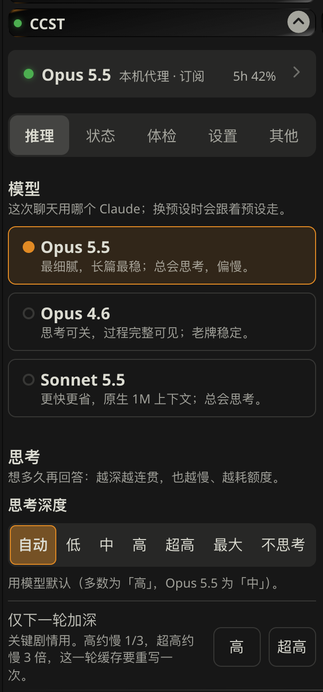
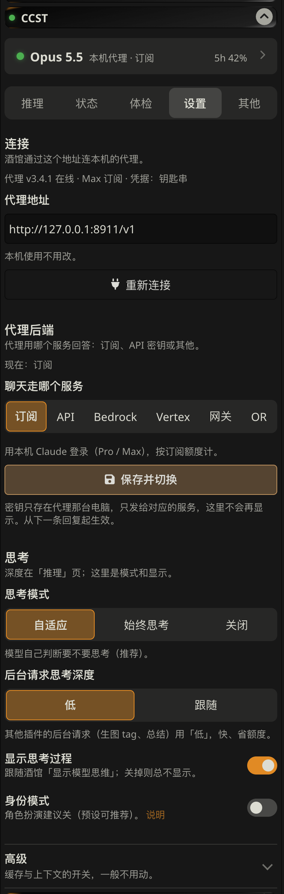

<div align="center">

# CCST

**Claude Code × SillyTavern**：给原版 SillyTavern 用的 Claude 懒人层。

一个酒馆服务端插件 + 一个面板：插件随酒馆启动一个本地代理，让你用自己的 **Claude Pro / Max 订阅**（或 API 密钥、Bedrock、Vertex、OpenRouter）聊天，并自动做好缓存排布、防丢回复、回复体检和额度统计；面板一键连接，只有思考深度一个要调的设置。

<sub>非 Anthropic 官方产品，与 Anthropic 无关。Claude 是 Anthropic 的商标。</sub>

[](https://github.com/kcgoofee-jpg/CCST/releases)
[](https://github.com/kcgoofee-jpg/CCST/actions/workflows/test.yml)
[](https://nodejs.org)
[](#快速开始)
[](LICENSE)


<sub>面板顶部的「灵动岛」：一个形状在状态之间弹簧变形，这张图也是代码画的（<a href="scripts/make_island_svg.py">scripts/make_island_svg.py</a>）</sub>

</div>

## 截图

<p align="center">




</p>

> 基于 [LukaTheHero/SillyTavern-ClaudeSubscription](https://github.com/LukaTheHero/SillyTavern-ClaudeSubscription)（AGPL-3.0）独立维护，感谢原作者。

> [!WARNING]
> 这不是 Anthropic 官方认可的用法，账号有被限制或封禁的可能。**使用前请先读[风险提示](#风险提示)。**

## 快速开始

准备：原版 [SillyTavern](https://github.com/SillyTavern/SillyTavern)（Chrome / Edge 打开）、Node 18 以上、Claude **Pro / Max** 订阅（或 API 密钥，见下）。

1. 在酒馆的 `config.yaml` 里设置：
   ```yaml
   enableServerPlugins: true
   ```
2. 在 SillyTavern 文件夹（有 `server.js` 的那一层）运行：
   ```bash
   node plugins.js install https://github.com/kcgoofee-jpg/CCST
   cd plugins/CCST
   npm install
   npm run login
   ```
   `npm install` **不要**加 `--omit=optional`（Claude CLI 在可选依赖里）；`npm run login` 会打开浏览器登录订阅账号，只需一次。
3. 重启 SillyTavern，浏览器强制刷新（Ctrl+F5）。看到日志 `[claude-subscription] initialised` 就是代理启动好了。
4. 打开「扩展」里的 **CCST** 面板，点 **一键连接**，在「API 连接」里选 Claude 模型，开聊。

面板没连上时会按你的情况说明缺什么（没装插件、要重启酒馆……）。

### 用 API 密钥 / Bedrock / Vertex / OpenRouter

不用订阅也行：面板「设置 → 代理后端」选好后端、填上密钥或区域，按 token 计费，「状态」页显示估算花费。风险最低的用法，见[风险提示](#风险提示)。

### 直连不跑代理

酒馆直连 Claude（「API 连接」选官方 Claude 源，或 OpenRouter 上的 Claude 模型）时，只装扩展（酒馆「扩展 → 安装扩展」，地址填 `https://github.com/kcgoofee-jpg/CCST`）就有：模型切换、预设推荐模型、发送前检查、回复体检、角色卡检查、灵动岛。缓存排布、防丢回复、额度统计要走代理。

### 服务器 / Docker

云服务器或 Docker 里跑：一条命令装代理并自动生成访问密码，或用镜像。见[使用指南 · 服务器与 Docker](docs/使用指南.md#服务器与-docker)。

### Mac 一键脚本（可选）

不想敲命令的 Mac 用户：双击 `launcher/mac/首次安装.command`，自动装依赖、登录、放一个桌面「酒馆工具」。详见[使用指南 · Mac 一键安装](docs/使用指南.md#mac-一键安装)。TauriTavern、安卓手机、命令行单跑代理、更新与卸载也在[使用指南 · 其他](docs/使用指南.md#其他mac-一键安装tauritavern-与命令行)。

## 使用

面板五页：

- **推理**：选模型（Opus 5.5 / 4.6 / Sonnet 5.5 等）和思考深度，其余自动处理。
- **状态**：上一轮缓存命中、额度、用量。
- **体检**：回复字数、禁词、重复段落、预设问题，发送前检查。
- **设置**：代理地址、后端、思考与高级开关。
- **其他**：重新引导、手机连接、省电显示、调试。

顶部「灵动岛」实时显示思考 / 写作 / 完成（字数 · 用时 · 缓存）。全部细节、缓存原理、环境变量：**[使用指南](docs/使用指南.md)**。

## 路线图

4.0 主线收敛到原版酒馆，4.1 首次引导与一键部署（服务器 / Docker / Windows CI）已完成。之后的计划见 [docs/路线图.md](docs/路线图.md)。

## 利弊

**好处**

- 用包月订阅额度，不另外按 token 付费，重度使用比 API 便宜得多。
- 聊天记录按真实多轮对话发送，角色区分更准，能用上提示缓存（长聊天每轮只写最近一楼）。
- 能直接设置原生思考深度（酒馆自带的「推理强度」对这种连接无效）。
- 不带编程助手提示词，也不读本机的 CLAUDE.md 和工具。
- 聊天内容不落盘；用量日志只记耗时和 token 数。代理只监听本机，并拒绝其他网站发来的请求。

**限制**

- 不支持温度、Top-P、Top-K（Agent SDK 不提供）。
- 预填是模拟的：末尾的 assistant 消息会变成「接着写」的指令，偶尔不会逐字接续。
- 额度和 Claude 网页版、Claude Code 共用，受 5 小时和 7 天窗口限制。
- 首字等待约 5 秒，比直接调用 API 稍慢。
- CLI 每轮会附带几段固定提醒（账号邮箱、系统环境、模型名、日期），关不掉；它们只发给 Anthropic，不影响剧情和缓存。
- 不支持向量嵌入（embeddings）。

## 风险提示

> [!CAUTION]
> 用订阅跑代理**不在** Anthropic 允许第三方产品的范围内，随时可能被限制或封号；不能接受就用 API 密钥。

- **不是官方认可的用法。** Agent SDK 官方文档写明：除非事先获得批准，不允许第三方产品使用 claude.ai 登录或订阅额度。Anthropic 随时可能限制这种用法，或对账号采取措施。
- **内容受 Anthropic [使用政策](https://www.anthropic.com/legal/aup)约束。** 政策禁止露骨的色情内容（包括色情聊天）；任何涉及未成年人的性内容，包括虚构和角色扮演，都绝对禁止并会被上报。订阅请求和官方客户端一样受审核，违规可能导致警告、限制或封号。
- **异常用量更容易被注意到。** 不要把代理开放给别人用，不要共享账号。
- **被拦截的请求也计入额度。** 例如 Opus 5 / 5.5 会拦截要求把思维链写进正文的预设（面板会提前提醒）。

作者不对账号被限制、封禁或其他损失负责。介意的话请改用 [Anthropic API](https://platform.claude.com/)：在面板「设置 → 代理后端」选 API 密钥，或在酒馆「API 连接」的 Custom API 密钥栏填入 `sk-ant-` 开头的密钥，代理就改按该密钥计费。这时缓存有效期自动设为 1 小时（写入按 2 倍价、读取 0.1 倍）；想用 5 分钟就在启动代理前设 `CLAUDE_CODE_PROMPT_CACHE_TTL=5m`。

## 常见问题

- **面板说没连上代理**：先看卡片提示。原版酒馆确认 `enableServerPlugins: true`、装了插件并已重启；单独运行代理的确认 `npm start` 在运行。
- **「未登录」或聊天中途认证失败**：在 `plugins/CCST`（或代理目录）运行 `npm run login`，用运行酒馆的同一个系统用户；`npm run auth` 查看状态。
- **「Failed to load @anthropic-ai/claude-agent-sdk」**：在代理目录重新 `npm install`（不加 `--omit=optional`），再重启。
- **Opus 5.5 第一轮报「套取推理过程」**：预设或世界书里有要求把思考写进正文的条目，把它关掉即可；面板发送前会指出是哪一句。
- **模型列表是空的**：再点一次一键连接，或在浏览器打开 `http://127.0.0.1:8901/status` 看代理状态。

更多见[使用指南 · 常见问题](docs/使用指南.md#常见问题)。

## 许可证

[GNU AGPL v3.0 或更高版本](LICENSE)
