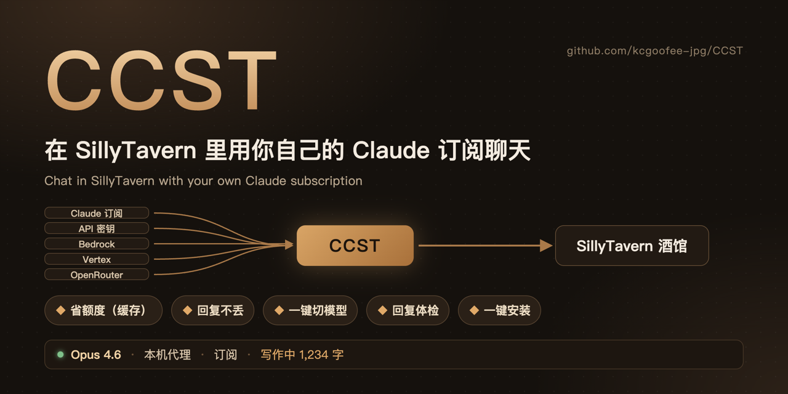

<div align="center">



**简体中文** · [English](README.en.md)

[](https://github.com/kcgoofee-jpg/CCST/releases)
[](https://github.com/kcgoofee-jpg/CCST/releases/latest)
[](https://github.com/kcgoofee-jpg/CCST/actions/workflows/test.yml)


[](LICENSE)

[安装](#安装5-分钟) · [使用指南](docs/使用指南.md) · [路线图](docs/路线图.md) · [更新记录](CHANGELOG.md) · [参与开发](CONTRIBUTING.md) · [安全](SECURITY.md)

<sub>非 Anthropic 官方产品，与 Anthropic 无关。Claude 是 Anthropic 的商标。</sub>


</div>

## 这是什么

酒馆本身只能用按量付费的 API。CCST 是一个酒馆插件，装上以后：

| | |
| --- | --- |
| 🎟️ **用订阅聊天**<br>Claude Pro / Max 直接用，不用另买额度；API 密钥、Bedrock、Vertex、OpenRouter 也行 | 💰 **长聊预计更省额度**<br>长聊天里通常能少重算一部分内容，靠缓存 |
| 🛟 **断线回复不丢**<br>浏览器关了、断网了，回复照样写完，回来自动补上 | 🔀 **一键切换模型**<br>Opus 5.5 / Opus 4.6 / Sonnet 5.5，思考深度随时调 |
| 🩺 **回复拒绝 / 截断提示**<br>模型拒绝、回复被截断或为空时，状态里直接写明；字数、禁词等检查在「其他」里，实验性 | 📦 **装起来很短**<br>原版酒馆：下载一键安装，双击就装好；Mac 上给 TauriTavern 和手机用：终端粘贴一行，做完直接进菜单 |

面板里还能看订阅额度和每轮用量。

> 关于效果：缓存、省额度等好处的大小取决于预设、世界书和其他扩展，只是预计，没有在所有组合上实测；面板里显示的每轮缓存命中率是实测值。

> [!CAUTION]
> 用订阅跑第三方程序**不在** Anthropic 允许的范围内，账号可能被限制或封禁。不能接受就用 API 密钥（见下面「其他用法」）。详见[风险提示](#风险提示)。

## 你需要

- 一台电脑（Mac / Windows / Linux），装好 [SillyTavern](https://github.com/SillyTavern/SillyTavern)。[Node.js](https://nodejs.org) 18 以上（没有的话一键安装会提醒你）。只用 TauriTavern / 手机、不用电脑上的酒馆：见下面「其他用法」的用法二（目前只支持 Mac）。
- Claude Pro 或 Max 订阅（或 API 密钥）。
- 浏览器用 Chrome 或 Edge。

## 安装（5 分钟）

不用打开终端、不用改任何文件。

**1. 在酒馆里装面板。** 酒馆顶部「扩展」（积木图标）→「安装扩展」，粘贴下面的链接，点安装：

```
https://github.com/kcgoofee-jpg/CCST
```

**2. 下载一键安装。** 装好后打开 **CCST** 面板，会看到一张「连不上 CCST 代理」的卡片，点里面的 **下载一键安装（Mac）** 或 **下载一键安装（Windows）**。（这是给电脑浏览器里的原版酒馆用的；TauriTavern 和手机不能装酒馆插件，卡片会改给别的步骤，见[使用指南「连不上时看哪一条」](docs/使用指南.md#连不上时看哪一条)。）

**3. 双击，跟着提示登录 Claude。** 双击下载的文件（Mac 下载的是压缩包，先双击解压，再双击里面的「CCST安装」）。它会自己找到酒馆、装好需要的东西，中间会打开浏览器让你登录 Claude 账号（只需一次）。全部完成时窗口里会写「装好了」。

- Mac 第一次打开可能提示「无法验证开发者」：macOS 15 以上双击会被直接拦（这是已知问题，[#22](https://github.com/kcgoofee-jpg/CCST/issues/22)，计划换成终端命令）：**系统设置 → 隐私与安全性 → 拉到底点「仍要打开」**；更老的 macOS 可以在文件上右键 →「打开」→ 再点「打开」。
- Windows 可能弹出蓝色的「Windows 已保护你的电脑」：点「更多信息」→「仍要运行」。
- 电脑里没有 Node.js 的话，它会替你打开下载页；装好后再双击一次就行。

**4. 重启酒馆。** 关掉酒馆再打开，浏览器按 `Ctrl+F5`（Mac 是 `Cmd+Shift+R`）刷新。面板会自动连上，之后就能聊天了。

以后只要正常启动酒馆，CCST 会跟着启动，不用再做任何事。想更新：再双击一次同一个文件。

<details>
<summary>装不上？</summary>

一键安装其实只做了下面这几件事，卡住的话可以自己手动做：

1. **打开服务端插件开关。** 用记事本打开酒馆文件夹里的 `config.yaml`，找到这一行改成 `true`：

   ```yaml
   enableServerPlugins: true
   ```

2. **下载 CCST。** 在酒馆文件夹（有 `server.js` 的那一层）打开终端，运行：

   ```bash
   node plugins.js install https://github.com/kcgoofee-jpg/CCST
   ```

3. **安装依赖并登录 Claude。** 接着运行（会打开浏览器让你登录 Claude 账号，只需一次）：

   ```bash
   cd plugins/CCST
   npm install
   npm run login
   ```

4. 重启酒馆，在 **CCST** 面板点 **一键连接**。

常见问题：

- **面板说「连不上 CCST 代理」**：确认 `config.yaml` 里是 `true`，并且重启过酒馆。酒馆的黑窗口里应该有一行 `[claude-subscription] initialised`。
- **一键安装说找不到酒馆**：把酒馆文件夹（里面有 `server.js`）拖进安装窗口，再按回车。
- **`npm install` 报错**：不要加 `--omit=optional`；Node 版本要 18 以上（终端运行 `node -v` 查看）。
- **面板说「没登录 Claude」**：再双击一次一键安装，或在 `plugins/CCST` 里运行 `npm run login`。
- **面板没出现**：强制刷新浏览器；还不行就在「扩展 → 管理扩展」里看 CCST 有没有被关掉。
- **一键安装被安全软件拦了 / 网页里没有下载按钮**：直接从[本仓库的 installer 文件夹](installer)下载，或按上面的手动步骤做。

</details>

## 使用

面板有 4 页，平时只用第一页。第一次打开时点顶部的 **一键连接**：它会在酒馆里新建并选中一个叫「CCST」的连接配置（模型沿用你已选的 Claude 模型，没有就选 Opus 4.6），并提示你到「API 连接」核对来源、地址和模型；你原来的连接配置不会被改。


| 页 | 干什么 |
| --- | --- |
| **推理** | 选模型、调思考深度（越深越慢越费额度） |
| **状态** | 当前聊天上一轮用了多久、缓存命中多少（回复结束自动刷新，还没回复时会写明）；最新回复被拒绝 / 截断 / 为空时写一行；订阅额度（点刷新，之后每条回复自动查）；近 7 天用量（可折叠） |
| **设置** | 代理地址、切换后端（订阅 / API 密钥 / Bedrock …）、思考选项、高级（缓存与上下文开关，后台请求的思考深度） |
| **其他** | 手机连接、Mac 遥控、省电显示、性能诊断、调试等不常用的功能；另有「体检（实验）」，默认关（字数、禁词、重复段落、角色卡检查，受预设和其他扩展影响，可能误报） |

## 其他用法

- **不用订阅，用 API 密钥 / Bedrock / Vertex / OpenRouter**：照上面装好，在面板「设置 → 代理后端」里切换并填密钥。密钥只存在你电脑上。
- **不装代理，直接连 Claude API 或 OpenRouter**：只在酒馆「扩展 → 安装扩展」里填本仓库地址。面板照样能切模型、查拒绝 / 截断，但没有防丢回复和额度统计。
- **酒馆装在服务器上 / 用 Docker**：见[使用指南 · 用法三](docs/使用指南.md#用法三-服务器与-docker)。
- **手机 TauriTavern、Mac 酒馆工具**（仅 Mac）：见[使用指南 · 用法二](docs/使用指南.md#用法二-tauritavern-与手机)。

**三种用法**：
- 用法一 原版酒馆（电脑）：上面的安装流程，[详细](docs/使用指南.md#用法一-原版酒馆)。
- 用法二 TauriTavern / 手机：电脑上独立跑代理，**目前只支持 Mac**。① 打开「终端」，粘贴一行安装命令（装到 `~/CCST`；装依赖、登录 Claude、放桌面快捷方式、启动代理、打开 TauriTavern 都直接做，做完直接进「酒馆工具」菜单，窗口不会自己关，按 `q` 退出）：
  ```bash
  zsh -c "$(curl -fsSL https://raw.githubusercontent.com/kcgoofee-jpg/CCST/main/install-mac.sh)"
  ```
  ② 在 TauriTavern 里装 CCST 扩展，面板点「一键连接」；③ 手机上用：菜单首页按 `1` 进「手机」页，按 `x` 开启手机模式，把那一页的「手机连接码」整串粘贴到手机面板的卡片里，点「连接」（也可以扫二维码后点复制）。更新：在终端再运行一次那一行（覆盖代码，保留登录和数据），然后在酒馆工具里选「重启代理」。[详细](docs/使用指南.md#用法二-tauritavern-与手机)。Windows / Linux 请用用法一或用法三。
- 用法三 服务器 / 云酒馆：一条命令或 Docker，[详细](docs/使用指南.md#用法三-服务器与-docker)（CI 已在 Linux 上实测安装和 Docker；Docker 镜像还没发布，需自己构建，发布流程已就绪，随下一个版本发布）。

更多细节（缓存原理、环境变量、所有设置项）在 **[使用指南](docs/使用指南.md)**，计划在 **[路线图](docs/路线图.md)**。

## 限制

- 不支持温度、Top-P、Top-K。
- 手机 / TauriTavern 连电脑上的代理（手机连接码、二维码、酒馆工具）目前只支持 Mac。
- 额度和 Claude 网页版共用，受 5 小时和 7 天窗口限制。
- 首字要等几秒，比直接用 API 慢一点。

## 风险提示

- **不是官方认可的用法。** 官方文档写明，未经批准不允许第三方产品使用 claude.ai 登录或订阅额度。Anthropic 随时可能限制这种用法，或对账号采取措施。
- **内容受 Anthropic [使用政策](https://www.anthropic.com/legal/aup)约束。** 政策禁止露骨色情内容；任何涉及未成年人的性内容都绝对禁止并会被上报。
- **不要把代理开放给别人，不要共享账号。**

作者不对账号被限制、封禁或其他损失负责。

> 基于 [LukaTheHero/SillyTavern-ClaudeSubscription](https://github.com/LukaTheHero/SillyTavern-ClaudeSubscription)（AGPL-3.0）独立维护，感谢原作者。

## 相关项目

- [tt-root-module（TT 守护）](https://github.com/kcgoofee-jpg/tt-root-module)：给已 root 的安卓手机用的 KernelSU 模块，自动备份、校验并同步手机上的 TauriTavern（及 SillyDroid、Termux 里的酒馆）数据，可一键恢复。手机上用 TauriTavern、担心聊天记录丢失的 CCST 用户可以装它。

## 许可证

[GNU AGPL v3.0 或更高版本](LICENSE)
